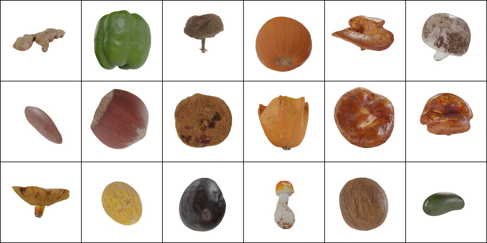
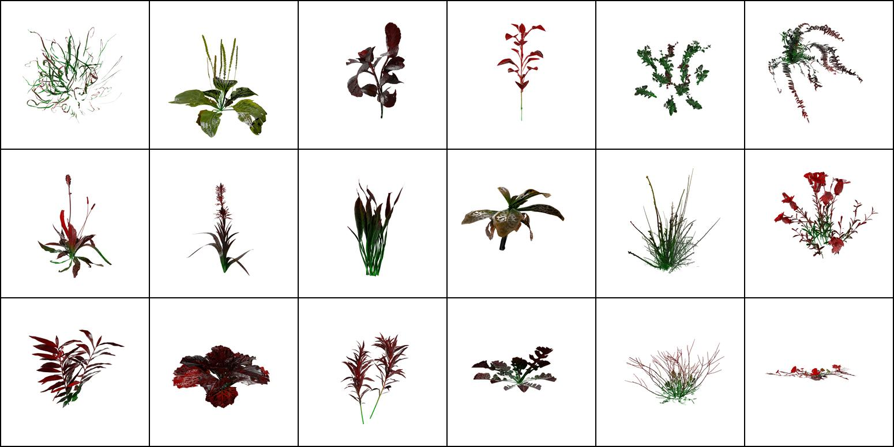

# Megascans Dataset from EpiGRAF [NeurIPS 2022]

In this repo, we provide the download links and the rendering code for Megascans Plants and Megascans Food datasets from "EpiGRAF: Rethinking training of 3D GANs" by Ivan Skorokhodov, Sergey Tulyakov, Yiqun Wang, Peter Wonka, presented at NeurIPS 2022.

<div style="text-align:center">

</div>

<div style="text-align:center">

</div>

## Download links

| Dataset                               | Resolution | #collections | #models | #images | Link                                                                                                            |
|---------------------------------------|------------|--------------|---------|---------|-----------------------------------------------------------------------------------------------------------------|
| M-Plants (raw RGB + depths + normals) | 1024x1024  | 232          | 2030    | 259840  | [181 GB](https://disk.yandex.ru/d/V5Pzp8fjpaEyAw)                                                               |
| M-Plants (filtered + processed)       | 1024x1024  | 198          | 1166    | 149248  | [49.3 GB](https://disk.yandex.ru/d/LJTtzCp82CE4MA)                                                              |
| M-Food (raw RGB/depths/normals)       | 1024x1024  | 10           | 281     | 35968   | [30 GB](https://disk.yandex.ru/d/oiFYT4gslpVTew) + [23.7 GB](https://disk.yandex.ru/d/umyuZSmIAJfDlg) (2 parts) |
| M-Food (filtered + processed)         | 1024x1024  | 10           | 231     | 29568   | [14.3 GB](https://disk.yandex.ru/d/yo6Mxi_zK5RqRQ)                                                              |

We split those files which exceed 50G into parts via the `zip -q file.zip --out file_split.zip -s 30G` command, so you'll need to download all the parts to unzip this multi-part archive.

The raw datasets are the ones which are obtained after "Step 3" in the rendering pipeline.
The "filtered + processed" datasets are the ones obtained after "Step 4" in the rendering pipeline.
Those are the datasets which we use for training the model.
For each model, 128 views are rendered (from random camera positions with fixed radius and the lookat always point to the coordinates center).

In the raw datasets, normal maps are provided as PNG, while depth maps are provided as EXR.

Note that the M-Food dataset contains some poisoned mushrooms, so we woulnd't recommend trying to eat some of the dataset objects.

## Reproducing the rendering pipeline (if you want to render custom Megascans collections)
### Step 1. Setting up Blender & Bridge

First of all, install Blender 2.93.10 (hash 0a65e1a8e7a9 built 2022-08-02 23:34:42).
**Note**: Blender regularly have API changes and if your Blender version will be different, this could lead to hard-to-find bugs and incompatibilities.
Next, you will need to download the [Bridge app by Quixel](https://quixel.com/bridge).

After that, install the [Megascans plugin for Blender](https://help.quixel.com/hc/en-us/articles/360007480698-User-Guide-Megascans-Plugin-for-Blender).
This process is art and we had several issues on some machines doing this.
Unfortunately, we do not remember what these issues were and how we solved them :(
In some cases, the problems were due to the incorrect Blender version.

Finally, you need to create [the Quixel account](https://quixel.com/pricing).

### Step 2. Extracting the GLB models

After you chose your plan, you need to login in Bridge and select the collections to export in Blender.
Open our provided `rendering.blend` scene in Blender and *do not change the objects in it*.
Then export your preferred megascans collectison into Blender.
See [the corresponding tutorial](https://help.quixel.com/hc/en-us/articles/360007480698-User-Guide-Megascans-Plugin-for-Blender) on how to do that.
We exported all the models with top specs and LOD0 only.
For Plants, we needed to manually "check-box" a lot of collections in Bridge.
After you loaded the models, copy-paste the `export_gltf.py` script into Blender scripting and launch it.
It will save the exported collections as GLB.
We cannot export GLB/GLTF models directly from Bridge (despite it has such an option), since Bridge has some bugs while doing so and the models are exported incorrectly (e.g. some parts of them are not exported, like some materials).

We recommend doing the above procedure in chunks, gradually accumulating GLB models, exporting 5-20 collections each time depending on how powerful your computer is.

The overall dataset structure is like (e.g., for Food) will be like this:
```
megascans_food
├ apple
  ├ apple_model.glb
  ├ another_apple_model.glb
  ...
  └ one_more_apple.glb
├ orange
  ├ orange_model.glb
  ├ another_orange_model.glb
  ...
  └ one_more_orange.glb
...
└ mushroom
  ├ mushroom_model.glb
  ├ another_mushroom_model.glb
  ...
  └ one_more_mushroom.glb
```

### Step 3. Rendering in Blender

After you obtained GLB models, it's time to render them in Blender.
You need to download an environment map (e.g., [this one](https://polyhaven.com/a/studio_small_09)), and save it.
Then specify `/path/to/my_environment_map.exr` in the config in `render_dataset.py`.

We assume that you have either some Linux-based OS or some other OS with Blender CLI.
Then navigate to the current repo and launch the following command:
```
blender --python render_dataset.py rendering.blend --background
```
The rendering config is located in `render_dataset.py`.

When rendering, we'll have a similar structure to the one specified in the previous step, where each model is unpacked into a directory of RGB images with the same name.
We save the camera matrices for each collection independently in `metadata.json` (though we do not use them for EpiGRAF training since 360-degree coverage is a good enough geometry inductive bias, leading to non-flat geometry).
Just in case, we also save normal maps and depth maps, though we do not use them.

This step is the most compute-consuming.
It took as ~0.5 days to render Megascans Food and ~2 days to render Megascans Plants on 4x NVidia Titan RTX.
Moreover, our pipeline (due to a bug in the codebase or in Blender) has a memory leak, which prevented the rendering of Megascans Plants in a single run due to out-of-memory problem.
This is why we'd been relaunching it by controlling the `collections_skip_up_to` argument in the config.

### Step 4. [Optional] Filtering out the models

In the dataset, some models can be very small (e.g., teen-tiny mushrooms) and consist mostly on white background and nothing else.
This might provide a poor training signal to the model, especially if it is trained patch-wise (like EpiGRAF).
This is why, we filter out small images using the following command:
```
python filter_models.py -s <path/to/dataset> -t <path/where/to/save/filtered/dataset> -r <ratio>
```
We use `ratio=0.05` for Foods and `ratio=0.03` for Plants.

Besides, this filtering procedure also removes some low-quality models, which we filtered out by manually inspecting the renderings of all the models.
Such low-quality models arise for two reasons: 1) the model has low amount from polygons (e.g., when the object is physically very small) or 2) it is out-of-distribution data (e.g., Megascans include leaves of some plants as standalone models).

### Step 5. Restructuring the dataset generator training

EpiGRAF model is based on [StyleGAN3 repo](https://github.com/NVlabs/stylegan3), which needs a dataset to have a specific structure to train the generator on it.
Namely, it needs a `dataset.json` file and does not need `metadata.json` files (which can be found in each collection directory), depths and normals maps.
Also, EpiGRAF and some other 3D GANs (in contrast to EG3D) need camera parameters to be in `[yaw, pitch, roll]` format rather than camera matrices.
We do this conversion by running the following command.
```
python prepare_megascans_dataset.py -d <path/to/dataset> -t <path/where/to/save/processed/dataset> --save_as_zip --num_jobs 32
```
This also resizes the dataset to the specified size and packs into a zip archive.

### License

We cannot release the original GLB models, but the RGB-D dataset itself is provided under the [MIT license](https://choosealicense.com/licenses/mit/).

### Bibtex

```
@article{epigraf,
    title={EpiGRAF: Rethinking training of 3D GANs},
    author={Skorokhodov, Ivan and Tulyakov, Sergey and Wang, Yiqun and Wonka, Peter},
    journal={arXiv preprint arXiv:2206.10535},
    year={2022},
}
```

### Acknowledgements

We would like to thank Ahmed Abdelreheem‬ and Wamiq Reyaz Para for showing Ivan Skorokhodov how to do the Blender stuff.
